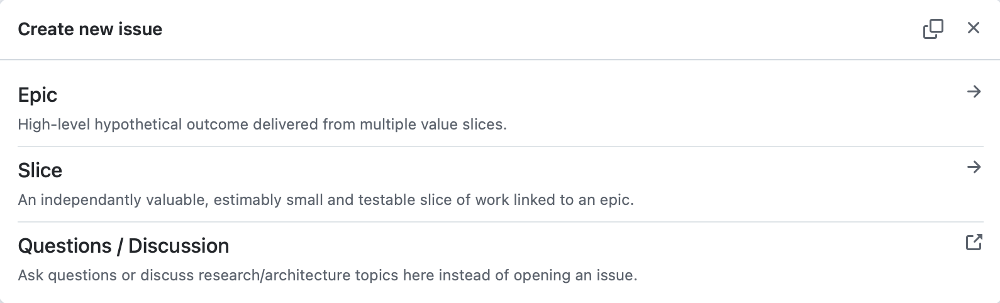
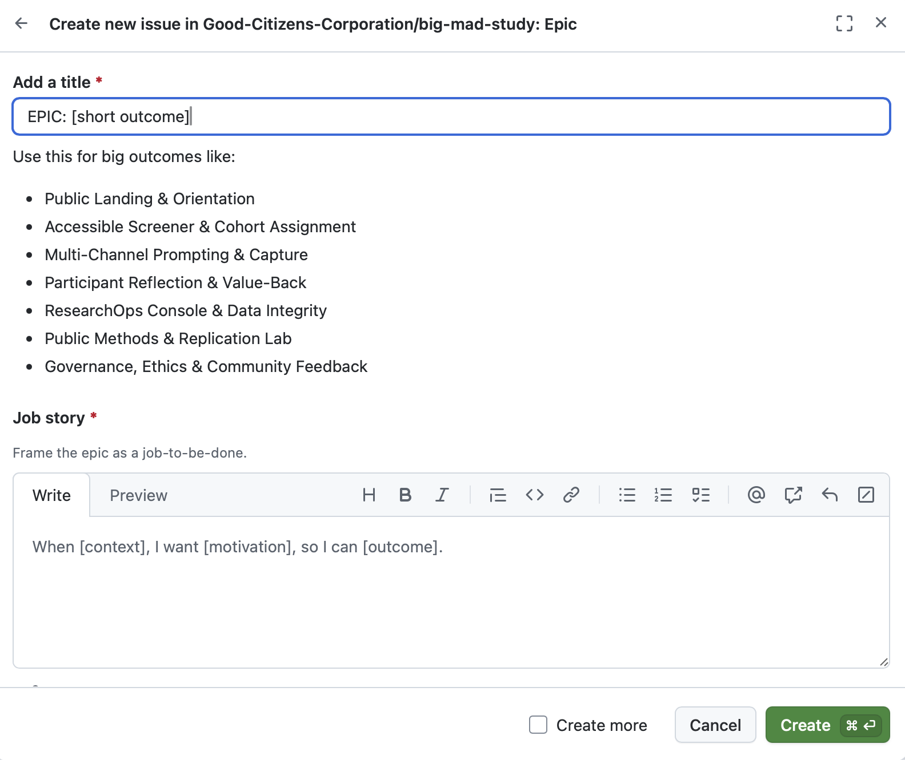
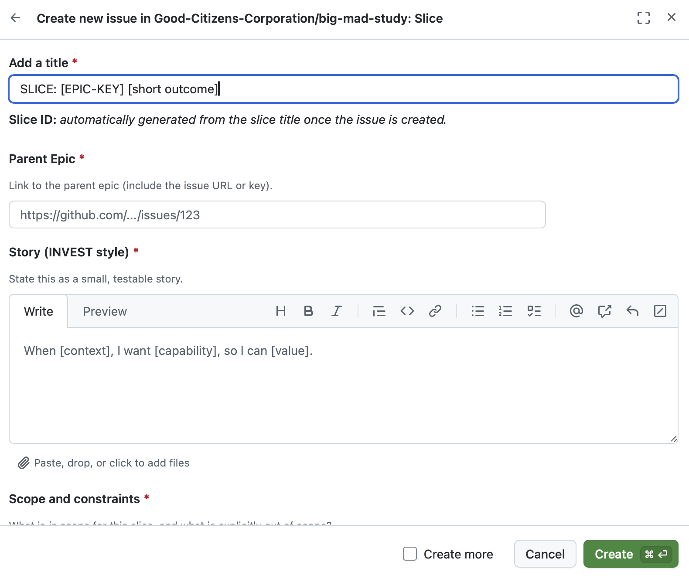

This is a [Next.js](https://nextjs.org) project bootstrapped with [`create-next-app`](https://nextjs.org/docs/app/api-reference/cli/create-next-app).

## Getting Started

First, run the development server:

```bash
npm run dev
# or
yarn dev
# or
pnpm dev
# or
bun dev
```

Open [http://localhost:3000](http://localhost:3000) with your browser to see the result.

You can start editing the page by modifying `app/page.tsx`. The page auto-updates as you edit the file.

This project uses [`next/font`](https://nextjs.org/docs/app/building-your-application/optimizing/fonts) to automatically optimize and load [Geist](https://vercel.com/font), a new font family for Vercel.

## Learn More

To learn more about Next.js, take a look at the following resources:

- [Next.js Documentation](https://nextjs.org/docs) - learn about Next.js features and API.
- [Learn Next.js](https://nextjs.org/learn) - an interactive Next.js tutorial.

You can check out [the Next.js GitHub repository](https://github.com/vercel/next.js) - your feedback and contributions are welcome!

## Deploy on Vercel

The easiest way to deploy your Next.js app is to use the [Vercel Platform](https://vercel.com/new?utm_medium=default-template&filter=next.js&utm_source=create-next-app&utm_campaign=create-next-app-readme) from the creators of Next.js.

Check out our [Next.js deployment documentation](https://nextjs.org/docs/app/building-your-application/deploying) for more details.

## Issue templates and workflows


This project uses GitHub issue templates to teach people how we make decisions. The files under `.github/ISSUE_TEMPLATE/` show one form for an EPIC (a big idea) and one form for a SLICE (a small story). Before we name any events or metrics, we define what success looks like so the rest of the story has a clear north star. Each form asks for:

- **What we think will happen (hypothesis).** Writing it out helps teams check if their idea is true later on instead of guessing. If the idea fails, the team still learns what changed.
- **How we will measure it (telemetry).** This lists the events or numbers we will track so we can tell if the idea worked. It keeps data tied to the story.
- **What success looks like (acceptance criteria).** These are plain-language checks that describe what concrete steps must happen before the work is done.

The epic form also asks for a job story so we describe the experience in context (When [context], I want [motivation], so I can [outcome]). It wants success metrics and a test plan because the learnings should survive pilots and interviews. The hypothesis block uses two lines ("H1: ..." and "H0: ...") so everyone names both the belief and its null—this makes the bet visible and keeps us honest when the data disagrees.

The Slice template also asks for a parent EPIC link and shows a placeholder for a short, unique ID so every small story stays tied to the right goal. The workflow at `.github/workflows/slice-id-generator.yml` watches for new slice issues and edits the placeholder with a slug (like `slice-accessible-screener`) that never conflicts with earlier slices.

If you want to follow the same process, copy the template files and the workflow from this repo, or share its URL with your team. The forms guide contributors through hypothesis-driven work, and the workflow keeps IDs consistent without any extra typing.

---

### Narrative examples

#### Epics


**Example inputs**

- Title: EPIC: Accessible Screener & Cohort Assignment.
- Job story: When a new participant starts the screener, I want the flow to ask for inclusive cues, so I can match them to the right cohort without losing momentum.
- Hypothesis: H1: If we build the screener with the new cues, completion will rise and more people feel ready to continue.
- Null: H0: Completion stays flat even after the new cues.
- Success metrics: Screener completion rate, cohort assignment accuracy, time spent per step.
- Test plan: Pilot with 10 participants, measure their completion, interview three about clarity.
- Telemetry: `screenerStarted`, `screenerSubmitted`, and props like `cohort_label`.
- Acceptance criteria: Checks such as accessible wording, validation errors, telemetry firing written as GIVEN/WHEN/THEN.
- Splitting approach: Independent, Negotiable, Valuable, Estimable, Small, and Testable slices.

**Why this matters**

- Title names the big change so people know what goal this epic is trying to reach.
- Job story keeps the story rooted in real experience.
- Hypothesis states the bet we plan to prove.
- Null identifies the opposite outcome we watch for.
- Success metrics prove whether the new cues helped without guessing.
- Test plan shows how we collect the data and validate the hypothesis.
- Telemetry keeps dashboards simple and forms a measurement contract so everyone agrees on the behaviors we track.
- Acceptance criteria stay structured, mirror the job story, and reduce ambiguity for testing.
- INVEST slicing keeps each piece small, measurable, and easy to build so we can forecast, stay in flow, and pivot fast while valuing only complete, working outcomes.

---

#### Slice example


**Example inputs**

- Title: SLICE: Accessible entry copy for screener.
- Parent EPIC: https://github.com/Good-Citizens-Corporation/big-mad-study/issues/13.
- Story: When someone reads the screener headline, the text should explain why we ask for details so they feel safe to move forward.
- Scope: Headline, subhead, and helper text only.
- Acceptance criteria: GIVEN/WHEN/THEN checks that the text is live, designers signed off, and helper text is readable.
- Tests: The unit checks or manual runs that prove the text works.
- Telemetry: `screenerCopyViewed` event with a `variant` property.
- Notes: Any unanswered questions, like whether to try a second wording.
- Slice ID: Workflow fills the placeholder with a unique slug (for example, `slice-accessible-entry-copy`).

**Why this matters**

- Title keeps the slice tied to the epic while showing this is one small thing.
- Parent link shows reviewers where this slice belongs.
- Story keeps the slice focused and testable.
- Scope clarifies the slice boundary so we don't work on anything else.
- Acceptance criteria stay clear and testable with GIVEN/WHEN/THEN language.
- Tests tell the automation team exactly what to run.
- Telemetry tells us which copy people saw so we can compare feel.
- Notes track unresolved questions.
- Slice ID gives us a short slug we can mention across conversations.

---

### FAQ

- **Why do we write H1 and H0?** H1 is our main belief; H0 is the opposite. Writing both keeps the team honest and makes it clear when the data proves the idea wrong.
- **What if I have no idea what the telemetry should be?** Pick the key events and values that will change if the idea works. You can start with one event (like `screenerSubmitted`) and add more as you learn.
- **When should I write an EPIC versus a SLICE?** An EPIC captures a big outcome with measures, while a SLICE is a small, testable story inside the epic. Start with the EPIC, then slice it using the INVEST rules so each slice can be built and validated on its own.
- **How do we split the EPICs?** We look at the EPIC goal and carve out stories that are Independent, Negotiable, Valuable, Estimable, Small, and Testable. That keeps work moving while still connecting every slice back to the epic.
- **How can I use these forms in my repo?** Copy the `.github/ISSUE_TEMPLATE/epic.yml`, `.github/ISSUE_TEMPLATE/slice.yml`, and the workflow file into your project, or direct teammates to this repo so they can download the YAML files themselves.

## Testing (TDD)

- We practice slice-level TDD: write or update the tests before changing the UI so every acceptance cue is guarded by automation. For this slice the landing hero tests live at [src/app/page.test.tsx](src/app/page.test.tsx), and each supporting page has its own smoke spec ([src/app/about/page.test.tsx](src/app/about/page.test.tsx), [src/app/methods/page.test.tsx](src/app/methods/page.test.tsx), [src/app/participants/page.test.tsx](src/app/participants/page.test.tsx)).
- Run `yarn test` (or `yarn test:watch`) to execute the Vitest suite and keep validation fast while you iterate.
- The BM-E2E-01 navigation check lives under [e2e/BM-E2E-01.spec.ts](e2e/BM-E2E-01.spec.ts) and exercises the happy-path flow from landing → about → methods → participants. Start it with `yarn test:e2e` once the dev server is running so the Playwright browser can click through each section.

### Testing pyramid example

We explain the pyramid by pointing at the slice tests: the Vitest specs for `/`, `/about`, `/methods`, and `/participants` form the wide Unit/Component base, while the Playwright BM-E2E-01 journey is the narrower apex.

```
			[Playwright]
		 /           \\
		/  BM-E2E-01  \\
	 /______________\\
	| Integration?   |
	| (future area)  |
	|---------------|
	| Unit / Component |
	|  page.test.tsx   |
	|  about/methods/  |
	|  participants/*.test.tsx |
	|_________________|
```

Follow the pyramid: keep the Vitest suite (`yarn test`) fast for component work, and rerun `yarn test:e2e` after `yarn dev` whenever the navigation story changes.

### TDD fundamentals

- **Red** – start by writing a tiny test that proves the slice should do something new. Let it fail so you know the change matters.
- **Green** – write just enough code to make the test pass. Keep it simple so you can see how the behavior works.
- **Refactor** – clean up the code without touching the test logic. Remove duplication, rename confusing bits, and rerun the tests to make sure they still pass.

Imagine it like solving a puzzle: you guess what the picture should look like (red), sketch one clean line to match it (green), then tidy the whole drawing so it stays clear (refactor).

### Refactor smells & SonarQube

- **Smells we watch for:** repeated logic, massive components, methods that try to do too much, and commented-out code that outlives its use. When those appear, step back and refactor before adding new features.
- **SonarQube keeps tabs** – the [sonar-project.properties](sonar-project.properties) file points Sonar at `src/`, the Vitest coverage report, and a handful of rules (for example, we intentionally mute `typescript:S1192` so string reuse follows the rule-of-3). Run `sonar-scanner` locally or via your CI to see new smells before they reach `main`.
- **Refactor checklist:** remove duplication, split responsibilities, simplify complex conditionals, and add a test if one is missing. The `yarn ci` script already runs lint/typecheck/test/build, so add `sonar-scanner` to that flow if the scan is part of your team’s gates.

### XP principles we keep alive

- **Continuous integration** – `yarn ci` mixes linting, typing, testing, and building so every change proves it works before we merge.
- **Collective ownership** – every slice stays small and documented so anyone can touch the landing shell, nav routes, or tests without fear.
- **Simplicity** – we keep layouts, copy, and styles lean so we can iterate quickly and refactor when the requirements grow.
